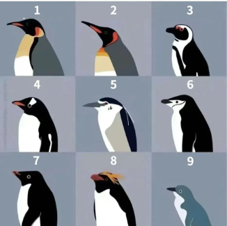

## Nycticorax

⠀

**Nycticorax** 是  [Leaf](https://leafmc.one/) 的实验性分支。

> [!WARNING]
> Nycticorax 是实验性分支, 不要在生产环境中使用, 风险自负。

[English](../../README.md) | **中文**

## 📫 联系方式
- Discord: [`https://discord.com/invite/gfgAwdSEuM`](https://discord.com/invite/gfgAwdSEuM)
- QQ社区群: `619278377`

## ⚖️ 许可证
请参阅 Leaf 的 [许可](https://github.com/Winds-Studio/Leaf?tab=readme-ov-file#%EF%B8%8F-license)
